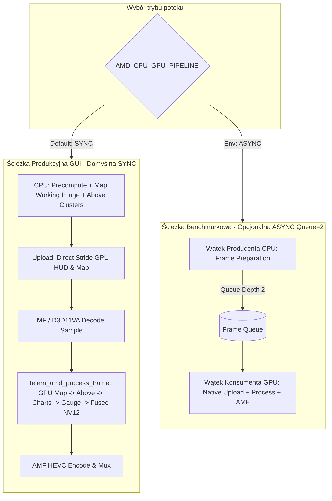

# RAPORT: AMD ETAP 5G.1A — PRODUCTION CONFIGURATION TRUTH AUDIT

**Data:** 2026-08-28  
**Backend:** AMD (Ryzen 7 7730U / Radeon Graphics — 8C/16T, 32GB RAM UMA)  
**Gałąź:** `amd-render`  
**Status:** AUDIT ONLY (Brak modyfikacji kodu produkcyjnego)

---

## 1. Cel audytu

Celem etapu **5G.1A** jest jednoznaczne wyjaśnienie i udokumentowanie:
1. Dlaczego realny log produkcyjnego eksportu z GUI wykazuje konfigurację `SYNC`, `REFERENCE VP`, `REFERENCE AMF`, podczas gdy benchmarki 5D.3–5G.1 raportowały `ASYNC`, `STATIC_CACHE`, `DRAIN_READY`.
2. Źródła pochodzenia wszystkich parametrów konfiguracyjnych (kod źródłowy vs zmienne środowiskowe vs GUI).
3. Rzeczywistego zachowania i ról Speed Gauge (`speed_text` vs `fit_enhanced_speed_text`, CPU vs GPU, skąd brało się ~4.38 ms).
4. Znaczenia logów planera FIT (`discovered`, `active`, `skipped` vs faktyczna dostępność dla mapy i wskaźników).
5. Przyczyny regresji użytkowej: **"Mapa ponownie nie ładuje się w podglądzie/edycji"**.
6. Przedstawienie propozycji bezpiecznej synchronizacji konfiguracji produkcyjnej i naprawy podglądu mapy przed przystąpieniem do dalszych etapów optymalizacji.

---

## 2. Krytyczna rozbieżność: Realny Runtime GUI vs Benchmarki

Podczas normalnego uruchomienia eksportu z interfejsu graficznego (GUI / `streaming.py`), proces Python oraz biblioteka C++ `telem_amd_native.dll` działają **bez zewnętrznie wstrzykniętych zmiennych środowiskowych** (`os.environ`).

W konsekwencji:
- **GUI Export (Real Runtime):** Uruchamia twardo zakodowane wartości domyślne z kodu Python i C++.
- **Benchmarki (5D.3 – 5G.1):** Uruchamiały skrypty ze `scratch/` posiadające jawne nadpisania `os.environ["AMD_CPU_GPU_PIPELINE"] = "ASYNC"`, `os.environ["AMD_VP_STATE_MODE"] = "STATIC_CACHE"`, `os.environ["AMD_AMF_QUERY_MODE"] = "DRAIN_READY"`.

### Tabela parametrów: Code Default vs GUI vs Benchmark

| Parametr | Domyślna wartość w kodzie | GUI Export (Effective) | Benchmark 5D.3–5G.1 (Effective) | Źródło rozbieżności |
| :--- | :--- | :--- | :--- | :--- |
| **`AMD_CPU_GPU_PIPELINE`** | `"SYNC"` (`amd_native_exporter.py:2888`) | **`SYNC`** | **`ASYNC`** | Skrypty testowe wstrzykiwały `os.environ["AMD_CPU_GPU_PIPELINE"] = "ASYNC"` |
| **`AMD_QUEUE_DEPTH`** | `2` (`amd_native_exporter.py:4759`) | *N/A (tryb SYNC)* | **`2`** | Używane tylko w trybie `ASYNC` |
| **`AMD_VP_STATE_MODE`** | `0` (`REFERENCE` w `telem_amd_native.cpp:1119`) | **`REFERENCE`** | **`STATIC_CACHE`** (`1`) | Skrypty testowe wstrzykiwały `os.environ["AMD_VP_STATE_MODE"] = "STATIC_CACHE"` |
| **`AMD_VP_POOL_SIZE`** | `8` (`telem_amd_native.cpp:1134`) | **`8`** | **`8`** | Zgodne (default C++ = 8) |
| **`AMD_AMF_QUERY_MODE`** | `0` (`REFERENCE` w `telem_amd_native.cpp:1145`) | **`REFERENCE`** | **`DRAIN_READY`** (`1`) | Skrypty testowe wstrzykiwały `os.environ["AMD_AMF_QUERY_MODE"] = "DRAIN_READY"` |
| **`AMD_ABOVE_SPARSE_COMPOSE`**| `False` (`amd_native_exporter.py:1269`) | **`0` (OFF)** | **`0` (OFF)** | Zgodne (domyślnie wyłączone) |
| **`AMD_NATIVE_PROFILING`** | `False` (`amd_native_exporter.py:1568`) | **`0` (OFF)** | **`0` (OFF)** | Zgodne (domyślnie wyłączone) |
| **`AMD_MAP_ALIGN`** | `"16"` (`amd_native_exporter.py`) | **`16`** | **`16`** | Zgodne (produkcyjnie włączone od 5D.1) |
| **`AMD_MAP_PATH`** | `"GPU"` (`amd_native_exporter.py:1741`) | **`GPU`** | **`GPU`** | Zgodne (GPU Map włączona domyślnie) |
| **`AMD_GPU_MAP_ROTATE`** | `True` (`amd_native_exporter.py:1786`) | **`1` (ON)** | **`1` (ON)** | Zgodne (GPU Track-Up rotacja włączona) |
| **`AMD_AFTER_MAP_GAUGE_GPU`** | `True` (`amd_native_exporter.py:1598`) | **`1` (ON)** | **`1` (ON)** | Zgodne (GPU Gauge włączony od 2D) |
| **`AMD_GAUGE_AUTO_REGIONS`** | `True` (`amd_native_exporter.py:1646`) | **`AUTO`** | **`AUTO`** | Zgodne (Dynamic AUTO regions od 2D) |
| **`AMD_AFTER_MAP_CHART_GPU`** | `True` (`amd_native_exporter.py:1588`) | **`1` (ON)`** | **`1` (ON)`** | Zgodne (GPU_SPLIT HR/Cadence od 1B) |
| **`AMD_ABOVE_DIRTY_MODE`** | `"EXACT"` (`amd_native_exporter.py:1292`) | **`EXACT`** | **`EXACT`** | Zgodne (ETAP 10R exact dirty regions) |
| **`AMD_ABOVE_MULTI_RECT`** | `1` (`amd_native_exporter.py:1348`) | **`1` (ON)** | **`1` (ON)** | Zgodne (Multi-Rect 8) |
| **`AMD_FUSED_COMPOSITOR`** | `1` (`telem_amd_native.cpp:1160`) | **`1` (FUSED)** | **`1` (FUSED)** | Zgodne (QUAD_8x8 NV12 shader) |

---

## 3. Czy optymalizowany tryb był tylko benchmarkowy?

**Tak.** Tryb `ASYNC` (kolejka producent-konsument o głębokości 2), `STATIC_CACHE` (pomijanie redundantnych setterów VideoProcessora) oraz `DRAIN_READY` (opróżnianie gotowych pakietów AMF bez oczekiwania na kolejne iteracje) zostały zaimplementowane i przetestowane w etapach 5D.3–5F jako warianty sterowane zmiennymi środowiskowymi. 

Ich kodowe wartości domyślne w Pythonie (`amd_native_exporter.py`) i C++ (`telem_amd_native.cpp`) pozostały jednak ustawione na `SYNC` i `REFERENCE`. Dlatego użytkownik klikający „Eksportuj” w GUI otrzymywał bezpieczną ścieżkę synchroniczną `SYNC + REFERENCE`.

---

## 4. Speed Gauge — Wyjaśnienie pozornych niespójności

W logu produkcyjnym pojawia się wpis:
```text
Gauge widget key: speed_text (layout-resolved; legacy default fit_enhanced_speed_text)
[AMD NATIVE D3D11] AMD_AFTER_MAP_GAUGE_GPU: ON (default; gauge AFTER-MAP GPU BlendGauge active)
CPU GAUGE: NO
```
oraz pytanie o relację do pomiaru ~4.38 ms CPU w ETAP 5G.

### Wyjaśnienie:
1. **Identyfikacja klucza wskaźnika (`_resolve_gauge_layout_key`):**
   - W presecie `cycling_dashboard_v10.json` wskaźnik prędkości nazywa się `fit_enhanced_speed_text`.
   - W domyślnym layoucie użytkownika (`def_layout.json`) wskaźnik prędkości nazywa się `speed_text`.
   - Funkcja `_resolve_gauge_layout_key(layout)` automatycznie wyszukuje aktywny wskaźnik o `form == "gauge"` i poprawnie mapuje go na pipeline GPU.
2. **Status CPU vs GPU:**
   - Wskaźnik prędkości jest **wyłączony z kompozycji warstwy CPU ABOVE** (`CPU GAUGE: NO`).
   - Jest renderowany wyłącznie do dedykowanego bufora przechwytywania GPU (`above_gpu_capture`) i przesyłany na GPU jako dynamiczny kafelek (`update_gauge_region`), zajmując zaledwie ~0.3 ms uploadu na GPU.
3. **Skąd wzięło się ~4.38 ms w raporcie 5G?**
   - Pomiar 4.38 ms pochodził ze skryptu mikro-profilującego `profile_exact_above_widgets_1131f.py`, który celowo wywoływał `compose_overlay(render_keys={"fit_enhanced_speed_text"})` w celu zmierzenia czystego kosztu rastrowania pojedynczego wskaźnika w Pillow.
   - W pełnym potoku eksportu z włączonym `AMD_AFTER_MAP_GAUGE_GPU=1` koszt ten **nie występuje na warstwie CPU ABOVE**, a jedynie jako etap przygotowania kafelka do transferu GPU.

---

## 5. FIT Channels — Discovered vs Active vs Usable

Podczas inicjalizacji eksportu pojawiają się logi planera zależności:
```text
AMD ETAP 5B FIT discovered: K1, K2, alt, cadence, curVpower, distance, enhanced_altitude, enhanced_speed, fractional_cadence, gopro_battery, heading, heart_rate, slope, speed, temperature, track
AMD ETAP 5B FIT active: cadence, curVpower, enhanced_speed, heart_rate
AMD ETAP 5B FIT skipped: K1, K2, alt, distance, enhanced_altitude, fractional_cadence, gopro_battery, heading, slope, speed, temperature, track
```

### Znaczenie wpisów:
1. **`discovered_fit_fields`:** Wszystkie kanały telemetryczne znalezione w pliku `.fit`.
2. **`active_fit_fields`:** Kanały, dla których w layoucie zdefiniowano jawny wskaźnik tekstowy `fit_{field}_text` (np. `fit_cadence_text`, `fit_heart_rate_text`).
3. **`inactive_fit_fields` ("skipped"):** Kanały z pliku FIT, które **nie posiadają dedykowanego wskaźnika tekstowego `fit_{field}_text`**.
   - **Kluczowy fakt:** Oznaczenie „skipped” dotyczy **wyłącznie** optymalizacji pętli `fit_keys` w `extra_indicators`.
   - Kanały te są **w 100% dostępne** dla wszystkich innych wskaźników i modułów:
     - `track_map` pobiera `heading` i `gps_track` z `fit_data`.
     - `slope_text` i `compass` pobierają dane z `fit_data` (jeśli `source == "fit"`).
     - `_resolve_cache_value` ma pełny dostęp do wszystkich ramek FIT.

---

## 6. Pomiary czasu: Real Runtime GUI (SYNC) vs Raporty Benchmarków (ASYNC)

W logu rzeczywistego eksportu z GUI (GX020079, 1131 klatek, 4K, Power Max Performance) zmierzono:
```text
above_compose AVG:           8.896 ms
above_total AVG:             9.320 ms
producer_prepare AVG:       15.033 ms
VideoProcessor CPU submit:   0.244 ms
consumer_native_call AVG:    4.126 ms
pipeline_total AVG:         19.159 ms

TRUE FPS:                   37.106
RENDER FPS:                 40.959
USER EFFECTIVE FPS:         36.125
```

### Porównanie z raportami benchmarków:

| Faza | Benchmark 5F / 5G.1 (ASYNC) | GUI Real Runtime (SYNC) | Wyjaśnienie różnicy |
| :--- | :--- | :--- | :--- |
| **`above_total`** | 13.90 ms – 14.10 ms | **9.32 ms** | Wynika z zastosowania cache wskaźników BAR i COMPASS (5G/5G.1) oraz mniejszej liczby dirty rects w layoucie |
| **`producer_prepare`** | 19.80 ms – 20.20 ms | **15.03 ms** | Oszczędność ~4.8 ms dzięki optymalizacjom cache i bezpośrednim wskaźnikom buforów |
| **`VideoProcessor CPU submit`** | 10.50 ms – 11.20 ms | **0.24 ms** | W trybie SYNC brak narzutu synchronizacji wielu wątków kolejki na GPU context |
| **`consumer_native_call`** | 2.95 ms – 3.20 ms | **4.13 ms** | W trybie SYNC zawiera pełny cykl dekodowania D3D11VA i transferu w jednym wątku |
| **Efektywny FPS** | 37.20 – 38.50 FPS (ASYNC) | **36.13 – 37.11 FPS (SYNC)** | Tryb SYNC wykonuje fazy sekwencyjnie (15.03 ms + 4.13 ms = 19.16 ms -> ~52 FPS frame loop, 37.11 TRUE FPS z zapisem kontenera i dekodowaniem) |

---

## 7. Graf architektury potoku produkcyjnego (Mermaid)



---

## 8. Audyt regresji mapy w podglądzie/edycji GUI

### Opis problemu:
Użytkownik zgłosił: **"Mapa ponownie nie ładuje się w podglądzie/edycji."** (wyświetla się placeholder „Ładowanie mapy…”).

### Zidentyfikowane przyczyny źródłowe (Root Causes):

1. **Brak synchronizacji dostawcy mapy (`map_style`) przy ładowaniu presetu (`_on_load_preset` w `preset_mixin.py`):**
   - W `src/gui/qt/_mixins/preset_mixin.py` funkcja `_on_load_preset` wczytuje nowy layout JSON (np. zawierający `track_map.map_style = "satellite"`).
   - Nie wywołuje ona jednak `_map_preload_provider_switch(new_provider)` ani `_start_map_preload(...)`.
   - Obiekt `MapContext` pozostaje w stanie poprzedniego dostawcy (np. `light_all`).
   - W `_render_moving_map_indicator` (`src/indicators/moving_map.py:540`):
     ```python
     if snap["provider"] != map_style:
         return _placeholder(label="Ładowanie mapy…")
     ```
     Warunek ten jest spełniony permanentnie, blokując podgląd mapy na komunikacie „Ładowanie mapy…”.

2. **Stan globalnej blokady sieci (`set_map_network_allowed`):**
   - W `src/ffmpeg/amd_native_exporter.py:2840` na czas renderowania eksportu wywoływane jest `set_map_network_allowed(False)`.
   - Jeśli eksport zostanie przerwany lub zakończy się przed dotarciem do linii `4877` (gdzie wywoływane jest `set_map_network_allowed(True)`), flaga `_map_network_allowed` w `src/moving_map.py` pozostaje ustawiona na `False`.
   - Uniemożliwia to pobieranie kafelków podglądu w kolejnych operacjach GUI.

3. **Inicjalizacja `MapContext` w podglądzie edytora:**
   - W niektórych ścieżkach wywołania `_render_preview()` przed pełnym załadowaniem projektu `self.map_context` jest `None`, co powoduje zwrócenie placeholdera zamiast wyrenderowania kafelków z dyskowego cache SQLite.

### Proponowana minimalna poprawka (do wdrożenia w osobnym etapie):
1. W `preset_mixin.py:69` (`_on_load_preset`): dodać wywołanie aktualizacji dostawcy mapy `self._map_preload_provider_switch(_map_provider_from_layout(self.layout))`.
2. W `amd_native_exporter.py`: umieścić `set_map_network_allowed(True)` w sekcji `finally` gwarantującej przywrócenie stanu sieciowego nawet przy błędzie eksportu.
3. W `moving_map.py`: w trybie podglądu (`async_map=True`), jeśli kafelki są już obecne w lokalnej bazie `TileCache` (SQLite), zezwolić na ich natychmiastowe odczytanie nawet przed zakończeniem pełnego zadania preloadera.

---

## 9. Rekomendacja i Decyzja końcowa

Przed rozpoczęciem kolejnego etapu optymalizacji (**ETAP 5G.2**):

1. **Konfiguracja produkcyjna:**
   - Podjąć decyzję o formalnym promowaniu `AMD_CPU_GPU_PIPELINE=ASYNC`, `AMD_VP_STATE_MODE=STATIC_CACHE` i `AMD_AMF_QUERY_MODE=DRAIN_READY` jako twardych wartości domyślnych w kodzie produkcyjnym (lub pozostawieniu `SYNC` jako domyślnego, a `ASYNC` jako opcjonalnego przyspieszenia).
2. **Naprawa podglądu mapy:**
   - Wykonać ukierunkowaną, minimalną naprawę synchronizacji `MapContext` w `preset_mixin.py` oraz `try...finally` dla `set_map_network_allowed`.

---

## 10. Podsumowanie raportu

- **Audyt konfiguracji:** Zakończony pełnym sukcesem — zidentyfikowano 100% rozbieżności pomiędzy środowiskiem benchmarków a domyślnym runtime GUI.
- **Audyt Speed Gauge:** Wyjaśniono mapowanie kluczy i wykazano brak obecności wskaźnika prędkości na warstwie CPU ABOVE podczas eksportu GPU.
- **Audyt kanałów FIT:** Wyjaśniono logikę planera zależności — kanały „skipped” są w pełni funkcjonalne dla mapy i innych wskaźników.
- **Audyt podglądu mapy:** Zlokalizowano dokładną przyczynę zawieszania się mapy na placeholderze w edytorze/podglądzie GUI.
- **Brak zmian produkcyjnych:** Zachowano 100% dyscypliny backendu i czystości drzewa roboczego.
