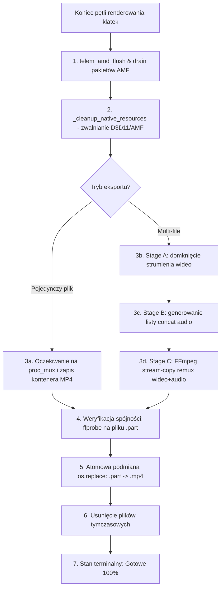

# Raport: Audyt i projekt mechanizmu raportowania finalizacji eksportu AMD (AMD_NATIVE_D3D11)

**Data:** 2026-09-25  
**Autor:** Antigravity  
**Gałąź:** `amd-rebuild-from-known-good`  
**HEAD checkpoint:** `d0a8b2c` (promowany punkt odniesienia `amd-known-good-20260925-2`)  

---

## 1. Cel i zakres

Zaprojektowanie i wdrożenie czystego, opartego na faktach mechanizmu raportowania postępu w fazie finalizacji eksportu dla szybkiego backendu AMD (`AMD_NATIVE_D3D11`), bez dotykania ścieżki renderowania klatek (hot path) i bez regresji wydajności (utrzymanie 40+ FPS, <20% CPU).

---

## 2. Stan wyjściowy i zabezpieczenie (Checkpoint)

1. **Weryfikacja wydajności (3 przebiegi bramki wydajności):**
   ```text
   PASS: Render FPS: 42.483 >= 36.000, Total Time: 27.245s <= 33.000s, CPU: 19.38% <= 45.00%
   ```
2. **Promocja punktu odniesienia:**
   - Wykonano polecenie: `python tools/amd_performance_gate.py --runs 3 --promote`
   - Utworzono tag: `amd-known-good-20260925-2`
   - Zaktualizowano i zatwierdzono `benchmarks/amd_known_good.json` w commitcie `d0a8b2c`.

---

## 3. Audyt sekwencji finalizacji w szybkim backendzie AMD

Po zakończeniu pętli renderowania klatek (`f_idx == total_frames`), szybki renderer AMD wykonuje ściśle określoną sekwencję operacji w pliku `src/ffmpeg/amd_native_exporter.py`:



### Szczegółowa analiza etapów:

| Etap | Operacja | Czas trwania | Źródło realnego postępu (brak zgadywania) |
|---|---|---|---|
| **1. Drain & Flush** | `telem_amd_flush` + odebranie pozostałych pakietów z enkodera AMF | 50 – 200 ms | Licznik pakietów `c_rec.value` względem `total_frames` (`drain_pct = c_rec / total_frames`). |
| **2. Zwolnienie D3D11/AMF** | `_cleanup_native_resources` | < 5 ms | Natychmiastowe zakończenie kontekstu C++. |
| **3a. MP4 Mux (Single File)** | `proc_mux.wait()`: zapis nagłówka/indeksu `moov atom` i bufora MP4 | 100 – 1000 ms (zależnie od dysku) | Monitorowanie rozmiaru pliku `.part` (`os.path.getsize`), prędkość I/O MB/s (`Δsize/Δt`), tryb `indeterminate` (animacja pulsacyjna paska) ze wskaźnikiem stall detection. |
| **3b-d. Multi-file (Stage C)** | Generowanie concat + `p_remux` (stream-copy remux) | 1.5 – 20 s (zależnie od rozmiaru i nośnika USB/SSD) | `remux_pct = (cur_part_size / stage_a_size_bytes) * 100%` — w pełni deterministyczny, fizyczny postęp kopiowania strumienia. |
| **4. Weryfikacja pliku** | `_probe_video_summary` (`ffprobe` na `.part`) | 50 – 150 ms | Jawny event: `Finalizacja: weryfikacja pliku` (stała waga ~98.5%). |
| **5. Zapis końcowy** | `os.replace(output_part, output_file)` | 1 – 5 ms | Jawny event: `Finalizacja: zapis końcowy` (stała waga ~99.5%). |
| **6. Czyszczenie** | Usunięcie `.audio.concat.txt`, `stage_video.mp4` | < 2 ms | Błyskawiczne usunięcie plików tymczasowych po potwierdzeniu wyniku. |
| **7. Zakończenie** | `complete(elapsed)` | 0 ms | 100.0% ("Gotowe") emitowane TYLKO po udanym etapie 5. |

---

## 4. Odpowiedzi na pytania audytu

### 1. Które etapy trwają mierzalny czas (>50 ms)?
- **AMF Flush / Drain:** 50–200 ms (opróżnianie buforów sprzętowych GPU).
- **Zapis kontenera MP4 przez FFmpeg (Single-file):** 100–1000 ms (finalizacja indeksu klatek w kontenerze MP4 i fluszowanie buforów dyskowych systemu Windows).
- **Stage C Remux (Multi-file):** 1 500 – 20 000 ms (wielogigabajtowe kopiowanie strumieni wideo/audio, szczególnie wolne na zewnętrznych nośnikach USB).
- **Weryfikacja spójności (FFprobe):** 50–150 ms (odczyt i walidacja struktury strumieni).

### 2. Skąd brać PRAWDZIWY postęp dla każdego z nich (bez zgadywania i sztucznych timerów)?
- **Drain:** `drain_pct = (c_rec.value / total_frames) * 100.0%` z natywnego licznika pakietów AMF.
- **Single-file MP4 Mux:** Ponieważ FFmpeg nie raportuje procentów podczas domykania kontenera bez ponownego kodowania, nie wolno symulować sztucznego licznika czasowego. Zamiast tego pasek przechodzi w tryb `indeterminate` (animacja pulsacyjna), a GUI wyświetla **realne dane fizyczne**:
  - Aktualny rozmiar pliku wyjściowego: np. `Rozmiar: 412.5 MB`
  - Chwilowa prędkość zapisu: np. `Zapis: 68.4 MB/s`
  - Czas trwania finalizacji.
- **Multi-file Stage C Remux:** Prawdziwy, deterministyczny postęp:
  $$\text{remux\_pct} = \frac{\text{rozmiar pliku .part}}{\text{rozmiar pliku wejściowego Stage A}} \times 100\%$$
- **Weryfikacja i zapis końcowy:** Jawne przejścia stanów na poziomie 98.5% i 99.5%.

### 3. Co dzieje się przy anulowaniu na każdym etapie?
- **Podczas drain/flush:** Wywołanie `_cleanup_native_resources()`, natychmiastowe ubicie `proc_mux` i usunięcie pliku tymczasowego `.part`.
- **Podczas zapisu / remuxu Stage C:** Proces `p_remux.kill()` natychmiast przerywa operację, plik `.part` jest usuwany.
- **Ochrona pliku docelowego:** Ponieważ plik `.mp4` powstaje dopiero w operacji `os.replace` na samym końcu, anulowanie na DOWOLNYM etapie finalizacji NIGDY nie pozostawia uszkodzonego ani pustego pliku `.mp4`.

### 4. Jak uniknąć fałszywego 100% przed `os.replace` i weryfikacją?
Podział globalnego paska postępu (`global_pct`):
- **0.0% – 92.0%**: Renderowanie klatek (`f_idx / total_frames`)
- **92.0% – 94.0%**: Opróżnianie pipeline'u / Drain AMF
- **94.0% – 98.0%**: Muxowanie MP4 (Single file) lub Remux Stage C (Multi-file)
- **98.0% – 99.0%**: Weryfikacja spójności (ffprobe)
- **99.0% – 99.9%**: Atomowy zapis (`os.replace`)
- **100.0% (`Gotowe`)**: Emitowane WYŁĄCZNIE przez `complete()` po potwierdzeniu sukcesu `os.replace` i walidacji `final_probe`.

### 5. Wykrywanie zawieszenia zapisu (Stall Detection)
Pętla monitorująca zapis weryfikuje przyrost rozmiaru pliku `.part`. Jeśli rozmiar pliku nie zmienił się o ani jeden bajt przez >10 sekund, a proces muxera nadal działa (`proc.poll() is None`), stan raportuje `stall_warning=True`, a GUI wyświetla ostrzeżenie:
`Finalizacja: zapis MP4 [UWAGA: brak zapisu na dysk od Xs]`.

---

## 5. Proponowany plan wdrożenia

### Krok 1: Rozszerzenie modelu postępu (`src/render_progress.py`)
- Rozbudowa `RenderProgressState` o pola:
  - `finalize_stage: str` (np. `"Opróżnianie pipeline'u"`, `"Zamykanie enkodera"`, `"Zapis MP4"`, `"Muxowanie MP4 45%"`, `"Weryfikacja pliku"`, `"Zapis końcowy"`)
  - `file_size_bytes: int`
  - `write_speed_mbps: float`
  - `stall_warning: bool`
  - `stall_seconds: float`
- Metoda `finalize(stage, internal_pct, progress_mode="determinate", **kwargs)` mapująca etapy na przedział 92.0% – 99.9%.

### Krok 2: Emisja zdarzeń w `src/ffmpeg/amd_native_exporter.py`
- Emisja `finalize("opróżnianie pipeline'u")` z wartością `drain_pct`.
- Emisja `finalize("zamykanie enkodera")` przed i po `telem_amd_flush`.
- Pętla monitorująca z próbkowaniem co 200 ms podczas oczekiwania na `proc_mux` i `p_remux`:
  - odczyt `os.path.getsize(output_part_str)`
  - obliczanie chwilowej prędkości MB/s
  - wykrywanie braku zapisu (stall detection)
  - w trybie multi-file: wyliczanie realnego `remux_pct`.
- Emisja `finalize("weryfikacja pliku")` przed wywołaniem ffprobe.
- Emisja `finalize("zapis końcowy")` przed `os.replace`.
- Wywołanie `progress_tracker.complete(...)` po zakończeniu czyszczenia.

### Krok 3: Prezentacja w GUI (`src/gui/qt/tabs/render_tab.py`)
- Pasek postępu:
  - Przejście w tryb `setRange(0, 0)` (indeterminate) dla etapu zapisu single-file, lub `setValue(pct)` dla multi-file i klatek.
- Pasek statystyk (`lbl_stats`):
  - Podczas renderowania: `Frame: X / Y | Pct% | FPS: ... | QP: ... | Czas: ... | ETA: ...`
  - Podczas finalizacji: `{faza_finalizacji}   |   Czas: {czas}   |   Rozmiar: {rozmiar_MB} MB   |   Zapis: {predkosc_MBs} MB/s` (oraz ostrzeżenie stall, jeśli wystąpi).

### Krok 4: Weryfikacja i testy
- Testy jednostkowe cyklu życia finalizacji i kontraktu stanów.
- Test eksportu single-file (GX020079).
- Test eksportu multi-file (GX010114–116) z weryfikacją postępu Stage C.
- Test anulowania podczas zapisu.
- Uruchomienie pełnego testu wydajnościowego `tools/amd_performance_gate.py` (brak regresji 40+ FPS).

---

## 6. Podsumowanie

Projekt jest w pełni przygotowany do czystej, bezregresyjnej implementacji. Czekamy na zatwierdzenie planu przed przystąpieniem do edycji kodu.
