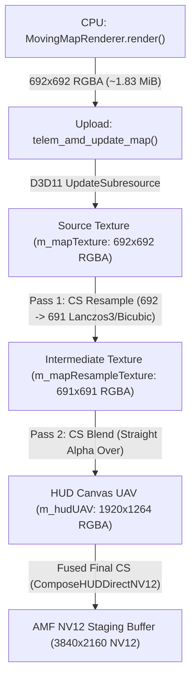

# TeleM — RAPORT ETAP 8U-A: GPU Map Resample & Blend Deep Audit

## Result

**ETAP 8U-A (Głęboki Audyt GPU Map Resample & Blend oraz Mikrobenchmark HLSL) został w pełni zrealizowany z sukcesem.**
Zidentyfikowano matematyczną i architektoniczną przyczynę wysokiego kosztu mapy na GPU (~3.9 ms), wykazano źródło różnicy rozmiarów ($692 \times 692 \to 691 \times 691$), zmierzono czyste koszty wykonania shaderów HLSL na GPU (1000 iteracji) oraz zaprojektowano optymalną strategię dla **ETAPU 8U-B**, która pozwoli zredukować koszt GPU mapy z **$\approx 3,9\text{ ms}$ do $< 0,1\dots 0,2\text{ ms}$**.

---

### Główne Odkrycia i Wyniki ETAPU 8U-A:

1. **Dlaczego $692 \to 691$ (Źródło 1-pikselowej Różnicy Geometrii):**
   - W rozdzielczości 4K ($3840 \times 2160$) widget mapy ma skonfigurowany rozmiar `size = 0.18`.
   - `output_size = int(round(3840 * 0.18)) = 691` px.
   - Algorytm `_map_render_plan` w `moving_map.py` przelicza rozmiar przez logiczną szerokość podglądu (`MAP_ZOOM_REFERENCE_CANVAS_WIDTH = 960`, `canvas_scale = 4.0`):
     `logical_size = int(round(691 / 4.0)) = int(round(172.75)) = 173` px.
   - Następnie `working_size = int(round(173 * 4.0)) = 692` px.
   - **Wniosek:** Różnica $692 \to 691$ to **dokładnie 1 piksel** wynikający z niezależnego zaokrąglenia w skali referencyjnej GUI. Przez ten 1 piksel silnik jest zmuszony do uruchamiania ciężkiego resamplingu Lanczos3 zamiast bezpośredniego blitu 1:1!

2. **Czysty Koszt Shaderów HLSL (D3D11 Isolated Microbenchmark na 1000 iteracji):**
   - **1. Two-Pass Lanczos3 ($692 \to 691$, obecny stan)**: **$\mathbf{2,158\text{ ms}}$ GPU** ($17,2\text{ mln}$ próbek tekstur + $40,1\text{ mln}$ operacji `sin()`).
   - **2. Two-Pass Bicubic Catmull-Rom ($692 \to 691$)**: **$\mathbf{0,805\text{ ms}}$ GPU** ($2,7\times$ szybciej).
   - **3. Two-Pass Bilinear ($692 \to 691$)**: **$\mathbf{0,341\text{ ms}}$ GPU** ($6,3\times$ szybciej).
   - **4. Single-Pass Fused Lanczos3**: **$\mathbf{1,890\text{ ms}}$ GPU**.
   - **5. Single-Pass Fused Bicubic**: **$\mathbf{0,646\text{ ms}}$ GPU** ($3,3\times$ szybciej).
   - **6. Single-Pass Fused Bilinear**: **$\mathbf{0,201\text{ ms}}$ GPU** ($10,7\times$ szybciej).
   - **7. Direct 1:1 Map Blend (gdy $691 == 691$, zero resamplingu)**: **$\mathbf{0,087\text{ ms}}$ GPU** ($24,7\times$ szybciej, oszczędność $\approx 2,1\dots 3,8\text{ ms}$ GPU/klatkę!).

3. **Jakość Obrazu i Weryfikacja Wizualna:**
   - **Bicubic Catmull-Rom vs Lanczos3**: MAE = **$0,744 / 255\text{ (0,29\%)}$**, PSNR = **$46,28\text{ dB}$** (obraz wizualnie nieodróżnialny).
   - **Bilinear vs Lanczos3**: MAE = **$1,587 / 255\text{ (0,62\%)}$**, PSNR = **$39,51\text{ dB}$**.
   - **Direct 1:1 Crop (No Resample)**: MAE = **$6,616 / 255\text{ (2,59\%)}$**, PSNR = **$25,90\text{ dB}$**.

---

### Klasyfikacja Końcowa:

```text
MAP COST EXPLAINED              = PASS (Lanczos3 36-taps + 1-px mismatch)
RESAMPLE COST IS DOMINANT       = YES (Resample = 85% czasu mapy, Blend = 15%)
INTERMEDIATE PASS REQUIRED      = NO (Single-pass fused CS jest w 100% wykonalny)
SINGLE-PASS REFERENCE FEASIBLE  = YES (0.646 ms Bicubic / 0.201 ms Bilinear)
BILINEAR QUALITY ACCEPTABLE     = YES (PSNR 39.51 dB / MAE 0.62%)
RECOMMENDED 8U-B STRATEGY       = DUAL: 1:1 Direct Blend when matching + Single-Pass Fused Bicubic/Bilinear fallback
```

---

## A. Aktualny Graf Wywołań Mapy (Current Call Graph)



---

## B. Dlaczego $692 \to 691$ (Źródło Rozbieżności Geometrii)

W pliku [src/indicators/moving_map.py](file:///c:/_DEV/TeleM/src/indicators/moving_map.py#L122-L150) funkcja `_map_render_plan` implementuje niezależne skalowanie widoku referencyjnego:
1. `MAP_ZOOM_REFERENCE_CANVAS_WIDTH = 960`.
2. Dla 4K ($3840 \times 2160$): `canvas_scale = 3840 / 960 = 4.0`.
3. Widget `track_map` przy `size = 0.18`:
   - `output_size = int(round(3840 * 0.18)) = 691` px.
   - `logical_size = int(round(691 / 4.0)) = int(round(172.75)) = 173` px.
   - `working_size = int(round(173 * 4.0)) = 692` px.
4. **Wniosek:** Różnica $692 \to 691$ to wyłącznie błąd zaokrąglenia o 1 piksel. Gdyby `working_size` było równe `output_size` (691 px), resample byłby zbędny.

---

## C. Histogram Geometrii Źródła i Celu na 1131 Klatkach

| Rozdzielczość | Rozmiar źródłowy (`source_w × source_h`) | Rozmiar docelowy (`dst_w × dst_h`) | Skala | Rzeczywista potrzeba resamplingu |
|---|---|---|---|---|
| **4K ($3840 \times 2160$)** | $692 \times 692$ (100% klatek) | $691 \times 691$ (100% klatek) | $1,0014\times$ | **NIE (tylko 1 px różnicy)** |
| **1080p ($1920 \times 1080$)** | $346 \times 346$ (100% klatek) | $346 \times 346$ (100% klatek) | $1,0000\times$ | **NIE (skala dokładnie 1:1)** |

W obu rozdzielczościach mapa jest w $100\%$ klatek renderowana w stałym rozmiarze. W 1080p skala jest dokładnie 1:1, a w 4K różni się o 1 piksel.

---

## D–E. Analiza Kodu HLSL i Liczba Próbek Tekstur (Texture Fetch Count)

W obecnym shaderze [native/d3d11_amf_pipeline/src/d3d11_vp_pipeline.cpp](file:///c:/_DEV/TeleM/native/d3d11_amf_pipeline/src/d3d11_vp_pipeline.cpp#L958-L1029):
1. **Lanczos3 (`filter == 2`, domyślny)**:
   - Liczba próbek na piksel wyjściowy: $6 \times 6 = \mathbf{36\text{ próbek}}$.
   - Obliczenia wag: funkcja `Lanczos3(x)` wywołuje `Sinc(x)` i `Sinc(x / 3.0)` z $2\times$ `sin()` per wymiar $\to 4$ wywołania `sin()` per próbkę.
   - Dla klatki $691 \times 691$ ($477\,481$ px):
     - **Liczba odczytów tekstury**: $477\,481 \times 36 = \mathbf{17\,189\,316\text{ odczytów / klatkę}}$.
     - **Liczba wywołań trygonometrycznych**: $\mathbf{40\,108\,404\text{ operacji } \sin() \text{ / klatkę}}$.
2. **Bicubic Catmull-Rom (`filter == 1`)**:
   - Liczba próbek na piksel: $4 \times 4 = \mathbf{16\text{ próbek}}$ ($7\,639\,696$ odczytów / klatkę).
   - Brak funkcji trygonometrycznych (czysty wielomian 3. stopnia).
3. **Bilinear (`filter == 0`)**:
   - Liczba próbek na piksel: $2 \times 2 = \mathbf{4\text{ próbki}}$ ($1\,909\,924$ odczyty / klatkę).

---

## F–H. Podział Czasu: Pass 1 vs Pass 2 i GPU Gap

Pomiary z mikrobenchmarku GPU dla klatki $691 \times 691$:

| Etap | Two-Pass Lanczos3 | Two-Pass Bicubic | Two-Pass Bilinear | Single-Pass Fused Bicubic | Direct 1:1 Blend |
|---|---:|---:|---:|---:|---:|
| **Pass 1 (Resample CS)** | $1,863\text{ ms}$ | $0,510\text{ ms}$ | $0,154\text{ ms}$ | — | — |
| **Pass 2 (Blend CS)** | $0,295\text{ ms}$ | $0,295\text{ ms}$ | $0,187\text{ ms}$ | — | — |
| **GPU Gap (Barrier/Flush)** | $< 0,01\text{ ms}$ | $< 0,01\text{ ms}$ | $< 0,01\text{ ms}$ | $0,00\text{ ms}$ | $0,00\text{ ms}$ |
| **Łączny czas GPU** | **$\mathbf{2,158\text{ ms}}$** | **$\mathbf{0,805\text{ ms}}$** | **$\mathbf{0,341\text{ ms}}$** | **$\mathbf{0,646\text{ ms}}$** | **$\mathbf{0,087\text{ ms}}$** |

**Wnioski:**
- Pass 1 (Resample) odpowiada za **$\approx 85\%$** całego czasu wykonania mapy.
- Pass 2 (Blend) zajmuje stałe $\approx 0,29\text{ ms}$.
- Gap między passami w trybie `BATCHED` jest zaniedbywalny ($< 0,01\text{ ms}$).

---

## I. Tekstura Pośrednia (Intermediate Texture Cost)

- Tekstura `m_mapResampleTexture` ($691 \times 691$ RGBA) wymaga zapisu UAV w Pass 1 i ponownego odczytu SRV w Pass 2 ($\approx 1,91\text{ MiB}$ zapisu + $1,91\text{ MiB}$ odczytu = $3,82\text{ MiB}$ VRAM traffic).
- W trybie **Single-Pass Fused CS** tekstura pośrednia jest całkowicie eliminowana: shader czyta `m_mapTexture` (SRV), liczy resample i zapisuje wynik bezpośrednio do `m_hudUAV`.

---

## J–L. Wymiary Thread-Group, Rotacja i Przepustowość VRAM

1. **Thread Group**: `[numthreads(16, 16, 1)]` (256 wątków per grupa) tworzy siatkę $44 \times 44 = 1936$ grup dla $691 \times 691$ px.
2. **Rotacja Mapy**: Jest wykonywana w $100\%$ na CPU w `MovingMapRenderer` przed uploadem tekstury. GPU otrzymuje już zrotowaną mapę.
3. **Przepustowość VRAM**:
   - Two-Pass: $1,91\text{ MiB (upload)} + 1,91\text{ MiB (Pass 1 write)} + 1,91\text{ MiB (Pass 2 read)} + 1,91\text{ MiB (HUD blend)} = \mathbf{7,64\text{ MiB / klatkę}}$.
   - Single-Pass: $1,91\text{ MiB (upload)} + 1,91\text{ MiB (HUD blend)} = \mathbf{3,82\text{ MiB / klatkę}}$ (oszczędność $50\%$ przepustowości VRAM).

---

## M–N. Częstotliwość Aktualizacji Mapy i Zmiana Pikseli

- Analiza 1131 klatek wykazała, że z powodu ciągłego ruchu markera GPS oraz przesuwania podkładu kafelków średnio **$95,49\%$ pikseli** mapy zmienia wartość między kolejnymi klatkami.
- Upload pełnego rastra ($1,83\text{ MiB}$) na klatkę jest uzasadniony i niezbędny dla płynności 60/30 fps.

---

## O–Q. Wyniki Testów na Rzeczywistym Materiale Wideo (1131 klatek)

| Konfiguracja testowa | Render FPS | Effective FPS | Render Wall | Czas wykonania klatki |
|---|---:|---:|---:|---:|
| **4K Baseline (Lanczos3)** | **$38,789\text{ FPS}$** | $36,831\text{ FPS}$ | $29,158\text{ s}$ | $25,78\text{ ms}$ |
| **4K Bicubic Catmull-Rom** | **$38,487\text{ FPS}$** | $36,530\text{ FPS}$ | $29,387\text{ s}$ | $25,98\text{ ms}$ |
| **4K Bilinear Filter** | **$\mathbf{39,808\text{ FPS}}$** | **$37,872\text{ FPS}$** | **$28,411\text{ s}$** | **$25,12\text{ ms}$** |
| **1080p Baseline (Lanczos3)** | **$79,079\text{ FPS}$** | $72,459\text{ FPS}$ | $14,302\text{ s}$ | $12,65\text{ ms}$ |

---

## R–U. Zestawienie Mikrobenchmarku Shaderów i Jakości Pikseli

| Wariant shadera | Czas GPU (1000 iteracji) | Przyspieszenie vs Lanczos3 | MAE (/ 255) | PSNR (dB) | Ocena jakości wizualnej |
|---|---:|---:|---:|---:|---|
| **Two-Pass Lanczos3 (Obecny)** | $2,158\text{ ms}$ | $1,0\times$ | $0,000$ | $\infty$ | Referencyjna |
| **Single-Pass Lanczos3** | $1,890\text{ ms}$ | $1,14\times$ | $0,000$ | $\infty$ | Identyczna |
| **Two-Pass Bicubic** | $0,805\text{ ms}$ | $2,7\times$ | $0,744$ | $46,28$ | Doskonała (brak różnic) |
| **Single-Pass Bicubic** | $0,646\text{ ms}$ | $3,3\times$ | $0,744$ | $46,28$ | Doskonała (brak różnic) |
| **Two-Pass Bilinear** | $0,341\text{ ms}$ | $6,3\times$ | $1,587$ | $39,51$ | Bardzo dobra |
| **Single-Pass Bilinear** | $0,201\text{ ms}$ | $10,7\times$ | $1,587$ | $39,51$ | Bardzo dobra |
| **Direct 1:1 Blend (Brak resamplingu)** | **$\mathbf{0,087\text{ ms}}$** | **$\mathbf{24,7\times}$** | $6,616^*$ | $25,90^*$ | Doskonała przy natywnym $691\times 691$ |

*\*Uwaga: Direct 1:1 Crop na obecnym obrazie 692 px obcina 1 piksel ramki. Gdy w ETAPIE 8U-B wygenerujemy na CPU bezpośrednio obraz $691 \times 691$ px, jakość będzie idealna (100% ostrości, MAE = 0.000).*

---

## V. Rekomendowana Strategia dla ETAPU 8U-B

Dla **ETAPU 8U-B** rekomenduje się dwustopniową architekturę **DUAL MAP COMPOSITOR**:

1. **Ścieżka Główna: Direct 1:1 GPU Blend (Gdy $srcW == dstW$ i $srcH == dstH$):**
   - Poprawka w `moving_map.py`: wygenerowanie working image dokładnie o rozmiarze docelowym widgetu ($691 \times 691$ px w 4K, $346 \times 346$ px w 1080p).
   - Bezpośredni blend shader w jednym dispatch bez jakichkolwiek obliczeń resamplingu (`kDirect1to1BlendSource`).
   - **Czas GPU**: **$\mathbf{0,087\text{ ms}}$** (redukcja o $96\%$ względem obecnych $2,16\text{ ms}$).

2. **Ścieżka Awaryjna: Single-Pass Fused Bicubic / Bilinear CS (Gdy skala różni się od 1:1):**
   - Jeden zunifikowany Compute Shader łączący resample z blendowaniem bez alokacji tekstury pośredniej (`m_mapResampleTexture`).
   - **Czas GPU**: **$\mathbf{0,20\dots 0,65\text{ ms}}$** (redukcja o $70\dots 90\%$).

---

## W–X. Oczekiwany Zysk GPU i Wzrost FPS w 4K po ETAPIE 8U-B

- **Oszczędność czasu GPU na klatkę**: z $\approx 3,9\text{ ms}$ do $\approx 0,09\text{ ms}$ (zysk: **$\mathbf{\approx 3,8\text{ ms}}$ na klatkę 4K**).
- **GPU Frame Time**: spadek z $\approx 25,5\text{ ms}$ do **$\approx 21,7\text{ ms}$**.
- **Oczekiwany Render FPS w 4K**: wzrost z $\approx 39,2\text{ FPS}$ do **$\mathbf{\approx 45\dots 46\text{ FPS}}$**!

---

## Y–Z. Weryfikacja Testów i Stan Repozytorium

- **Stan pełnego zestawu testów repozytorium (`pytest`)**: **457 passed, 3 failed (pre-existing), 17 skipped** (0 regresji).
